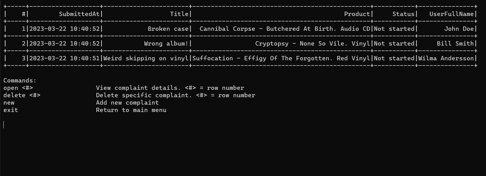
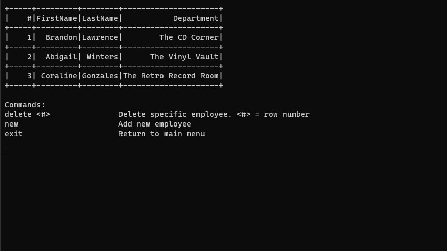

# **ComplaintTracker**

An Entity Framework Core / .NET application made for organizing product complaints. Part of my data storage course at _ECUtbildning_.

## **About**

The app was created using a code-first approach. The app currently uses a local .mdf file but could easily be modified to utilize any Microsoft SQL Server. 
The application contains quite a few views and allows you to perform different CRUD operations on the 8 different tables. 

The repo contains a database with dummy data. If you wish to create your own database from the ground up check out the instructions on how to do this in the how to run section.

If any of the tables are displaying incorrectly make sure your window is wide enough.

### **Main complaint view**

This is the main view of the customer complaints. It allows you to delete, create or open a detailed view of a complaint.
 
 

### **Detailed complaint view**

From here you can create comments and change complaint statuses (not started, under investigation and closed). You can also view additional information that wasn't
shown in the table in the main complaint view.
 
 

### **Main product view**

This is the main products view, it allows you to view all products, delete products and create new ones.
 
 

### **Main Employee view**

Here you can see the employee view. You can create new employees or delete existing ones.
 
 

## How to run the app

There are quite a few ways to run the application. All of them will require you to install the [.NET 7 sdk](https://dotnet.microsoft.com/en-us/download/dotnet).

#### Method 1

Simply navigate to the folder Data_Storage_Submission (the one containing the .csproj file) and run `dotnet run`.

#### Method 2 

Navigate to the same folder as in method 1. Run `dotnet build` and then navigate to ...\Data_Storage_Submission\bin\Debug\net7.0 and run the file called Data_Storage_Submission.exe.

#### Method 3

Open the solution in Visual Studio and run it from there.

### Creating a new database without dummy data

Delete the original .mdf file (located in ComplaintTracker\Data_Storage_Submission\Context) and create a new one of the same name. Don't forget to open the package manager console and running `update-database`. In program.cs the method `initializeDataService.InitializeAll();` is called, this will populate the new database with the exact same data as the included database. To prevent this change `.InitializeAll()` to `.InitializeStatusTypes();`, this will only add the status types to your new database.

